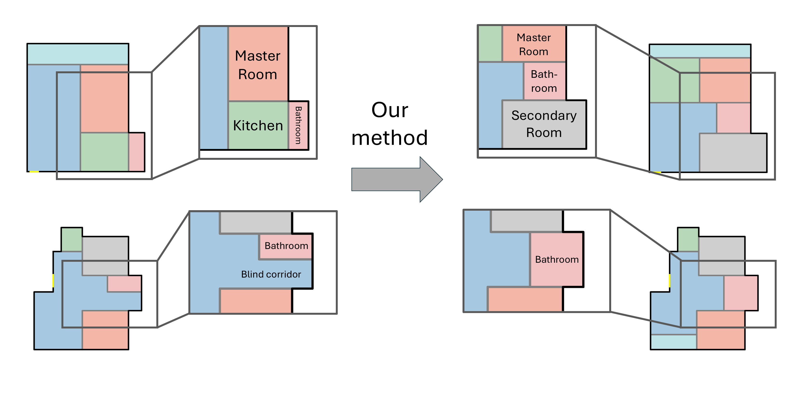

# What a Comfortable World

Framework for deep learning driven floor plan generation.

## Overview



Current data-driven floor plan generation methods often reproduce the ergonomic inefficiencies found in real-world training datasets. To address this, we propose a novel approach that integrates architectural design principles directly into a transformer-based generative process. We formulate differentiable loss functions based on established architectural standards from literature to optimize room adjacency and proximity. By guiding the model with these ergonomic priors during training, our method produces layouts with significantly improved livability metrics. Comparative evaluations show that our approach outperforms baselines in ergonomic compliance while maintaining high structural validity.

**Key Features:**
- Framework designed for training GPT-2 based models on [RPLAN](https://wutomwu.github.io/particulars.html?id=1) dataset
- Custom losses derived from expert knowledge
- Masked inference - ignoring invalid outputs of the model - for more accurate inference

## Repository Layout:
- `src/` — source code
- `configs/` — YAML configuration files for dataset preprocessing and model training
- `data/` — input data for training and testing
- `preprocess.py`, `train.py`, `evaluation.py`, `synthesis.py` — main entry points

## Requirements
- Linux is recommended operating system. Not tested on Windows or MacOS.
- Cuda 12.6
- Python 3.12+
- See `requirements.txt` for Python dependencies.

## Setup (with venv)

### Virtual environment
Run these commands from the repository root.

```bash
# Create virtual environment
python3 -m venv venv

# Activate virtual environment
source venv/bin/activate

# Upgrade pip and install deps
python -m pip install --upgrade pip
pip install -r requirements.txt
```

### Dataset

1. Download already preprocessed version of [RPLAN](https://wutomwu.github.io/particulars.html?id=1) dataset from [Graph2Plan paper repo](https://github.com/HanHan55/Graph2plan/releases/tag/data).
2. Extract `data.zip` file.
3. In extracted folder find `data.mat` file in `Network/` folder.
4. Copy `data.mat` file to `data/` folder in this repo.

### Dataset preprocessing

Preprocessing performs data augmentation and converts floor plans into sequences that are used for training

```bash
python preprocess.py <path to config> <path to .mat file with dataset>
```

Preprocessing configs are stored in `configs/preprocessing` path. In the same folder there is also `config_explanations.yaml`, which documents all available options for preprocessing.

### Training

In order to train a model use:
```
python train.py --config <path to training config>
```

Training configs are stored in `configs/` directory. Similarly, like for preprocessing `config_explanations.yaml` contains all supported options with explanations.

Results from training should appear in `runs/` directory. Learning process can be examined using `tensorboard`:
```bash
tensorboard --logdir runs/
```

To continue training from checkpoint refer to training script documentation
```bash
python train.py --help
```

### Evaluation

The following script can be used to evaluate the model by synthesizing a large number of floor plans and compute various metrics:
```bash
python evaluation.py <path to model> <path to preprocessed dataset folder>
```

For additional options like saving created floor plans or enabling masked inference refer to:
```bash
python evaluation.py --help
```

### Synthesis

The following script allows you to synthesize 10 new floor plans from scratch:
```bash
python synthesis.py <path to model> 10 --draw_imgs
```

For additional options, such as saving the generated floor plans, see:
```bash
python synthesis.py --help
```

## Results form paper

To reproduce results from paper [What a Comfortable World: Ergonomic Principles Guided Apartment Layout Generation](https://comfortableworld.github.io/) run these commands from project root directory:

```bash
python preprocess.py configs/preprocessing/paper.yaml <path to .mat file with dataset>

# Baseline training
python train.py --config configs/paper_baseline.yaml

# Our method
python train.py --config configs/paper_our.yaml

# Evaluation
python evaluation.py <path to model> data/paper
```

## Notes
- Repo supports [pyenv](https://github.com/pyenv/pyenv) via `.python-version` file.
